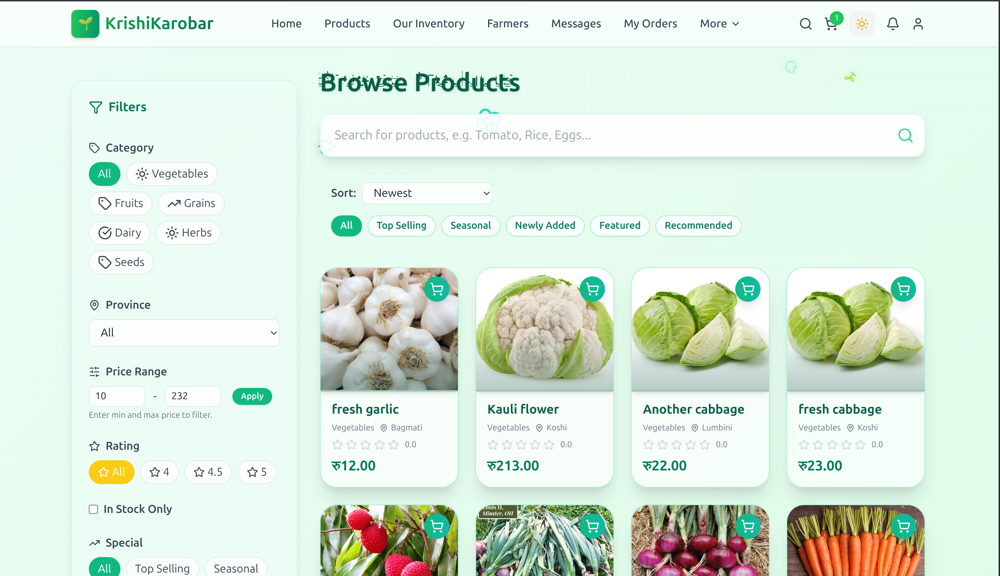

# KrishiKarobar – Farmer–Customer Marketplace

KrishiKarobar is a full‑stack web application that connects farmers and customers.
Customers can browse and order farm products, manage their cart and orders, message
farmers, and leave reviews. Farmers get a dashboard to manage products, respond to
orders/messages, and see basic analytics.

- **Frontend:** React + Vite + Tailwind CSS (folder: `frontend/`)
- **Backend:** Django REST Framework (folder: `KrishiKarobarBackend/`)
- **Auth / Roles:** Role‑based flows for **Customer** and **Farmer**

---

## Demo Screenshots



More Screenshots are stored in the top‑level `assets/` folder:

- `assets/demo_register.png` – registration / onboarding
- `assets/demo_products.png` – product listing
- `assets/demo_product_details.png` – product details + cart
- `assets/demo_cart.png` – customer cart and checkout
- `assets/demo_product_reviews.png` – reviews UI
- `assets/demo_farmer_profile.png` – farmer profile
- `assets/demo_farmer_dashboard_messaging.png` – farmer dashboard + messaging


---

## Features

### Customer

- Browse available farm products with details and images
- View **product details**, add to **cart**, update quantities, and place orders
- View **order history** and order status
- Search / explore **nearby farmers** (sorted by distance using OpenStreetMap/
  geolocation‑based logic)
- View **farmer profiles** (details, products, ratings)
- Send **messages / contact requests** to farmers
- Add **reviews** and ratings on products and/or farmers
- User authentication and role‑based access as a **Customer**

### Farmer

- Sign up / log in as **Farmer**
- Farmer **dashboard** with overview and basic analytics
- Full **CRUD for products** (create, update, delete, manage inventory)
- Receive and manage **orders** from customers
- See **customer messages** and reply
- View reviews / feedback on products
- Role‑based access for farmers only

### Backend (Django & REST API)

- Django REST Framework–based API for products, inventory, orders, users, messaging,
  and notifications
- JWT and token authentication via `djangorestframework_simplejwt`
- CORS configured for Vite dev origins (`localhost:5173`, etc.)
- SQLite by default (easy local setup)
- Static/media handling for product images, profiles, and uploads

### Frontend (React js)

- Vite + React with React Router for SPA routing
- Tailwind CSS for styling + some custom CSS modules
- Components for:
  - Role‑specific dashboards (Customer / Farmer)
  - Product listing & details
  - Cart and checkout flow
  - Reviews and ratings
  - Messages / conversations
- Axios‑based API layer for talking to the Django backend
- Animations and UI polish with Framer Motion and MUI icons/components

---

## Project Structure

```text
KrishiKarobar/
├─ assets/                     # Demo screenshots for README / docs
├─ frontend/                   # React + Vite frontend
│  ├─ src/
│  │  ├─ App.jsx, Home.jsx, ...
│  │  ├─ Components/           # Shared and dashboard components
│  │  ├─ api/                  # Frontend API helpers (Axios)
│  │  ├─ context/              # Auth & Theme context
│  │  ├─ data/                 # Static/mock data helpers
│  │  └─ styles/               # CSS / Tailwind custom styles
│  └─ package.json
└─ KrishiKarobarBackend/       # Django backend
   ├─ manage.py
   ├─ requirements.txt
   ├─ backend/
   │  ├─ settings.py
   │  ├─ urls.py
   │  ├─ wsgi.py
   │  └─ ...
   ├─ users/, products/, orders/, inventory/, connections/, notifications/
   ├─ media/                   # Uploaded media (products, profiles, etc.)
   └─ Dockerfile               # Backend Docker image definition
```

---

## Getting Started (Without Docker)

### 1. Backend – Django API

From the project root:

```bash
cd KrishiKarobarBackend
python -m venv venv
source venv/bin/activate  # on Windows: venv\\Scripts\\activate
pip install -r requirements.txt
```

Run migrations and start the dev server:

```bash
python manage.py makemigrations
python manage.py migrate
python manage.py runserver 0.0.0.0:8000
```

Optionally create a superuser:

```bash
python manage.py createsuperuser
```

Now the API should be available at `http://localhost:8000/`.

### 2. Frontend – React (Vite)

In a new terminal from the project root:

```bash
cd frontend
npm install
npm run dev
```

The frontend dev server will start on `http://localhost:5173/` by default
(Vite). Make sure any API base URL in the frontend points to
`http://localhost:8000`.

---

## Running with Docker (Backend)

The Django backend includes a Dockerfile so you can run the API in a container.
From the project root:

```bash
cd KrishiKarobarBackend
# Build the image
docker build -t krishi-backend .

# Run the container (development‑oriented configuration)
# Make sure to adjust/extend env vars as you need.
docker run -p 8000:8000 \
  -e DJANGO_SUPERUSER_USERNAME=admin \
  -e DJANGO_SUPERUSER_PASSWORD=admin123 \
  -e DJANGO_SUPERUSER_EMAIL=admin@example.com \
  krishi-backend
```

The container:

- Installs dependencies from `requirements.txt`
- Applies migrations (and, depending on the Dockerfile configuration, may run
  `collectstatic` and auto‑create a superuser)
- Serves the Django app via `gunicorn` or the development server on port `8000`

Then run the React frontend locally as usual (`npm run dev`) and point it to
`http://localhost:8000`.

> Note: At the moment only the backend is dockerized. The frontend typically runs
> with `npm run dev` in development, but you could add a separate Dockerfile for
> the React app if you want a fully containerized stack.

---

## Environment & Configuration

Key backend settings are in `KrishiKarobarBackend/backend/settings.py`:

- `DATABASES` – defaults to SQLite; can be changed to PostgreSQL/MySQL for
  production
- `MEDIA_ROOT` / `MEDIA_URL` – uploaded images (products, profiles, reviews)
- `STATIC_URL` and `STATIC_ROOT` – for staticfiles/collectstatic in production
- Email configuration (SMTP) for verification / notifications (currently
  console backend by default)

CORS is configured to allow `localhost` Vite dev origins so the frontend can
call the API without issues.

---

## Possible Extensions

Current Limitations :

- Integrate real‑time notifications (WebSockets) for orders/messages

---

## Contact
Ganesh Neupane
Email: [ganeshneupane1357@gmail.com](mailto:ganeshneupane1357@gmail.com)
Portfolio: [https://ganesh-neupane.com.np](https://ganesh-neupane.com.np)